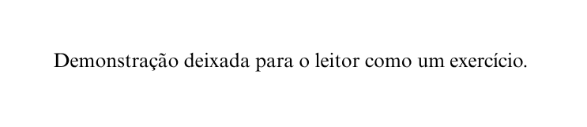
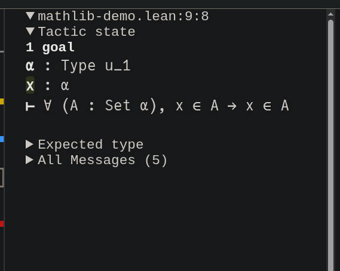

# Git avançado

<div id="sumario" class="sumario-git">
    <h1>Sumário</h1>
    <summary><a href="#git-avancado">Git avançado</a></summary>
    <ul>
      <li>
        <details>
          <summary><a href="#desfazendo-alteracoes">Desfazendo alterações</a></summary>
          <ul>
            <li><a href="#desfazendo-commits-sem-ter-publicado">Desfazendo commits sem ter publicado</a></li>
          </ul>
        </details>
      </li>
      <li>
        <details>
          <summary><a href="#workflow-avancado">Workflow avançado</a></summary>
          <ul>
            <li><a href="#git-branching">Git branching</a></li>
          </ul>
        </details>
      </li>
      <li>
        <details>
          <summary><a href="#git-merging">Git merging</a></summary>
          <ul>
            <li><a href="#fast-forward-merge">Fast-forward merge</a></li>
            <li><a href="#three-way-merge">Three-way merge</a></li>
            <li><a href="#lidando-com-conflitos">Lidando com conflitos</a></li>
          </ul>
        </details>
      </li>
      <li><a href="#projeto-pt1">Projeto pt.1</a></li>
    </ul>
  <button class="toggle-button" id="toggle-button">
  
      Esconder Sumário
  
  </button>
  </div>
Sejam todos bem vindos ao quarto dia do nosso curso de Introdução as Demonstrações Matemáticas! Nesse dia nos aprofundaremos nas diferentes formas e estratégias de demonstração presentes na Matemática e seremos aprensentados ao Lean, um assistente de demonstrações poderoso que nos ajudará a demonstrar propriedades matemáticas de maneira mais eficaz e assertiva.

## As diferentes formas de demonstração

Existem diferentes estratégias para se demonstrar propriedades matemáticas, e escolher a certa pode, muitas vezes, ser a diferença entre uma demonstração bem sucedida feita em 4 linhas e uma demonstração impossivel de ser concluida.
Estudaremos algumas delas, entendendo como funcionam e em quais situações elas podem ser úteis para a gente.

<div style="text-align: center;"> </div>

### Demonstração por força bruta


O método mais simples para demonstrações pequenas, que dependem de poucos casos específicos.

> Exemplo: demonstrar que todos os membros do conjunto de naturais {1, 3, 15,78, 6, 4, 2} são menores do que 80.

Imagine ter que demonstrar uma propriedade para um conjunto de 500 mil elementos!

Como conseguiriamos utilizar isso para demonstrar uma propriedade de um conjunto infinito? Spoiler: Não dá!

### Demonstração direta


É chamada de demonstração direta quando conseguimos demonstrar o nosso alvo apenas utilizando os quantificadores em sua forma “padrão” e os dados que temos ou obtivemos.


> Exemplo: utilizar de exemplo alguma demonstração simples feita no dia 3 sobre conjuntos.


### Demonstração por escolha ou contra-exemplo


Para lidar com o quantificador do existêncial (∃), basta escolhermos alguém que satisfaça suas condições necessárias. A mesma coisa acontece quando queremos demonstrar a negação ou refutar um para todo (∀), basta escolhermos um contra-exemplo que **não** satisfaça tais propriedades. 

> Exemplo: (∃p ∈ Primos)[p par]

> Exemplo: (∀ p ∈ Primos)[p ímpar];

### Demonstração por contradição 💥(BOOM!)💥


Imagine que apartir de uma hipotese seja possível de chegar na conclusão de que 0 = 1? Assim é chamada a demonstração por contradição. Tendo nossas hipotéses, podemos supor por contradição que o alvo é falso e tentar chegar a algo claramente falso.

>Exemplo: -INCOMPLETO-

### Demonstração por indução/recursão

Podemos utilizar da recursão para demonstrar algumas propriedades desejadas. Para isso, precisamos ter um passo base e um passo recursivo:

 >Exemplo: -INCOMPLETO-
 
## Ferramentas de Proof Assistant e Introdução ao Lean

Já pensou se nossas demonstrações matemáticas fossem cercadas de incertezas, e se pudessem estar erradas por causa de erros ou desvios? Quais seriam as consequências disso nas aplicações que dependem dessas demonstrações? BOOM!

Foi a partir dessas dúvidas que surgiram ferramentas que ajudam nas demonstrações matemáticas — os chamados Proof Assistants, ou provadores de teoremas.

O provador de teoremas que vamos usar se chama Lean, um sistema criado no Brasil e que hoje é utilizado pela comunidade matemática internacional.

O Lean é uma linguagem de programação que funciona tanto como linguagem funcional quanto como provador de teoremas.

### Lean Overview

Sabe toda aquela conversa sobre alvo, dados e hipóteses? O Lean tem uma aba de visão geral que ajuda bastante, mostrando qual é o alvo a ser demonstrado, os dados disponíveis, as hipóteses e as variáveis que estão no escopo.

<div style="text-align: center;">  </div>

>futuramente o link do live-lang.org

### Quantificadores em Lean

Em Lean, os quantificadores funcionam da mesma maneira na qual foram abordados anteriormente.

### Lean tactics

As táticas do Lean são os "comandos" utilizados nas demonstrações. A ideia é bem parecida com o que fizemos até então nas demonstrações feitas em sala. Para cada quantificador, temos maneiras diferentes de atacá-los ou utilizá-los. Algumas táticas também são utilizadas para criarmos novos dados e terminar a demonstração.

#### intro
`intro` é a maneira de atacar um alvo da forma (∀) ou de atacar uma implicação, ou seja, supor algo. Numa demonstração feita no papel escreveríamos "Seja x" ou "suponha p". A única diferença é que quando estamos supondo uma hipótese, invés de escrevermos a hipótese toda, escreveremos apelas um "apelido" para ela. Por exemplo, não escreveriamos `intro x ∈ A`, mas sim `intro h`, e h vira o "apelido" de x ∈ A.

#### exact
`exact` é a principal maneira de terminar uma demonstração. Quando temos em nossos dados a coisa que queremos demonstrar, usamos `exact (apelido da hipótese)`. No papel escreveriamos "Logo" ou "então".

Dado o enunciado `(∀x)(∀ A conjunto)[x ∈ A ⇒ x ∈ A]`, o demonstrariamos da seguinte maneira no papel:
```
Seja x.
Seja A um conjunto.
Suponha x ∈ A.
Então x ∈ A.
```
Essa mesma demonstração ficaria da seguinte maneira em Lean:

```lean
example : ∀ (x : α) (A : Set α), x ∈ A → x ∈ A := by {
 intro x  -- Seja x.
 intro A  -- Seja A.
 intro h  -- Suponha h : x ∈ A.
 exact h  -- Então h : x ∈ A.
}
```

Note que nem a lógica, nem os passos da demonstração mudaram!

#### use
`use` é a maneira de atacar um alvo de forma (∃). Numa demonstração no papel diríamos "tome x" ou "use x".

Dado o enunciado (∃ x natural)[x ∈ {n l n > 0}], o demonstrariamos da seguinte forma no papel:

```
Use 1.
Como 1 > 0, então 1 ∈ {n l n > 0}.
```

A mesma demonstração em Lean ficaria da seguinte maneira:

```lean
example : ∃ x : Nat, x ∈ {n | n > 0} := by {               
use 1   -- use 1
-- a partir daqui, nos resta demonstrar que 1>0
exact Nat.one_pos  -- Nat.one_pos é o axioma que diz que 1>0, então faz sentido usar esse exact.
}
```
A lógica da demonstração em Lean segue parecida, a diferença é que quando escrevemos no papel, tendemos a deixar algumas informações implicitas, o que a princiípio não é problema, mas pode se transformar em um, a depender do tamanho da nossa demonstração.

#### have
`have` é a maneira de criar um dado novo utilizando dados que já temos. Note que você não pode "criar" um dado do nada, precisa demonstrá-lo! No papel escreveriamos "vou demonstrar que", "temos que _, visto que _", "temos _, logo _"

Dado o enunciado (∀x) (∀ A, B, C conjuntos) [A ⊆ B ⇒ B ⊆ C ⇒ x ∈ A ⇒ x ∈ C], o demonstrariamos no papel da seguinte maneira:
```
Seja x.
Sejam A, B, C conjuntos.
Suponha A ⊆ B.
Suponha B ⊆ C.
Suponha x ∈ A.
Temos que x ∈ B, visto que x ∈ A e A ⊆ B.
Logo, temos que x ∈ C visto que x ∈ B e B ⊆ C.
```

Em Lean, a demonstração segue a mesma lógica:

```lean
example {α} : ∀ (x : α ) (A B C : Set α ), A ⊆ B → B ⊆ C → x ∈ A → x ∈ C := by {
intro x      -- seja x
intro A B C  -- sejam A, B, C
intro h1     -- suponha h1 : A ⊆ B
intro h2     -- suponha h2 : B ⊆ C
intro h3     -- suponha h3 : x ∈ A

have h4 : x ∈ B := h1 h3 -- Temos h4 : x ∈ B, visto que h1 : A ⊆ B e h3 : x ∈ A
have h5 : x ∈ C := h2 h4 -- Temos h5 : x ∈ C, visto que h2 : B ⊆ C e h4 : x ∈ B
exact h5
}
```
A sintaxe funciona da seguinte maneira:

`nome_da_hipótese : hipótese := demonstração`

#### apply
`apply` é a tática que serve para aplicarmos uma hipótese em nosso alvo ou em outra hipótese, mudando sua forma. No papel escreveriamos "basta demonstrar que  _". Aplicar uma hipótese x a uma hipótese y muda a forma da hipótese y.
Por exemplo, se x : (∀ n natural)[n impar ⇒ n > 0] e y : n impar, `apply x at y` mudaria y para y : n > 0.

Utilizando da mesma demonstração passada, podemos demonstrar ela no papel seguindo um caminho diferente:

Enunciado : (∀x) (∀ A, B, C conjuntos) [A ⊆ B ⇒ B ⊆ C ⇒ x ∈ A ⇒ x ∈ C]

```
Seja x.
Sejam A, B, C conjuntos
Suponha A ⊆ B.
Suponha B ⊆ C.
Suponha x ∈ A.
como B ⊆ C, então basta demonstrar que x ∈ B.
como A ⊆ B, então basta demonstrar que x ∈ A.
Então x ∈ A.
```

Em Lean, essa estratégia diferente fica da seguinte maneira:

```lean
example {α} : ∀ (x : α ) (A B C : Set α ), A ⊆ B → B ⊆ C → x ∈ A → x ∈ C := by {
intro x      -- Seja x
intro A B C  -- Sejam A, B, C conjuntos
intro h1     -- Suponha A ⊆ B
intro h2     -- Suponha B ⊆ C
intro h3     -- Suponha x ∈ A

apply h2     -- como B ⊆ C, então basta demonstrar que x ∈ B
apply h1     -- como A ⊆ B, então basta demonstrar que x ∈ A
exact h3
}
```

#### rw[_]
Quando queremos substituir algo no nosso alvo ou em alguma hipótese por algo que já temos nos nossos dados, podemos usar a tática `rw [dado]`, que reescreve o alvo ou a hipótese. No papel escreveriamos "Como x = y, então basta demostrar P(y)"

Dado o enunciado (∀x) (A, B cojuntos) [B = A ⇒ x ∈ A ⇒ x ∈ B], o demonstrariamos da seguinte maneira no papel:
```
Seja x.
Sejam A, B conjuntos.
Suponha B = A.
Suponha x ∈ A.
Como B = A, então basta demonstrar que x ∈ A.
Então x ∈ B.
```

Em Lean, a mesma demonstração fica da seguinte maneira:
```lean
example {α} : ∀ (x : α) (A B : Set α), B = A → x ∈ A → x ∈ B := by {
intro x            -- Seja x
intro A B          -- Sejam A, B conjuntos
intro hipotese.BA  -- Suponha B = A
intro hipotese.A   -- Suponha x ∈ A
rw[hipotese.BA]    -- Como B = A, então reesreva meu alvo
exact hipotese.A
}
```
Mais uma vez, a lógica da demonstração em Lean é parecida com a demonstração no papel, a diferença é que essa "reescrita" no papel é feita de maneira mais implicita.


## Tabelinha das tactics

Para ajudar a lembrar da utilidade de cada tactis, criamos essa tabelinha com seu nome, sua utilidade e sua tradução. Existem muito mais tactics em Lean, mas essas são as principais que aparecem em todas as demonstrações!

<table>
  <thead>
    <tr>
      <th>Tactic</th>
      <th>Utilidade</th>
      <th>Tradução</th>
    </tr>
  </thead>
  <tbody>
    <tr>
      <td>Intro</td>
      <td>Usado em (∀) e para supor hipóteses</td>
      <td>"Seja" ou "Suponha"</td>
    </tr>
    <tr>
      <td>Exact</td>
      <td>Termina a demonstração.</td>
      <td>"exatamente"</td>
    </tr>
    <tr>
      <td>Use</td>
      <td>usado em (∃)</td>
      <td>"Use" ou "Tome"</td>
    </tr>
    <tr>
      <td>Have</td>
      <td>cria um novo dado</td>
      <td>"Temos"</td>
    </tr>
    <tr>
      <td>Apply</td>
      <td>aplica uma hipotese ao alvo ou a um dado</td>
      <td>"Basta demonstrar que" ou "aplico x em y para obter _"</td>
    </tr>
    <tr>
      <td>rw[]</td>
      <td>reescreve o alvo ou o dado</td>
      <td>"Como x=y e P(x), então P(y)"</td>
    </tr>

  </tbody>
</table>