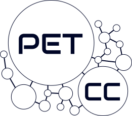

--- 
layout: home
title: Minicurso de Introdução às Demonstrações Matemáticas
---

# {{ page.title }}

 

Bem vindo ao site oficial do Minicurso de Introdução às Demonstrações Matemáticas ofertado pelo PET de Ciência da Computação.

O Minicurso será ofertado do perído de XX/08/2025 até XX/08/2025, e as aulas serão das XXh até as XXh, no
Departamento de Informática e Matemática Aplicada (DIMAp), UFRN, na sala Laboratório de Ensino.

Você pode consultar o material das aulas que foram ministradas até agora em [`/aulas`](/aulas.md) e saber mais sobre o Minicurso em geral em [`/sobre`](/sobre.md).



## Objetivo do Curso

Esse curso foi desenvolvido pelo PETCC com o objetivo de introduzir conceitos matemáticos - sobretudo aos calouros do BTI e do BCC - e facilitar o entendimento de materiais em disciplinas futuras de Matemática Discreta, Fundamentos Matemáticos da Computação e Matemática para Computação ao longo de sua formação. Desmistificando as demonstrações, expondo que elas não são apenas formalidades, mas ferramentas poderosas para a resolução de problemas reais da computação.

PRECISAMOS MUDAR ISSO:
Assim, guiados por pesquisas de demanda e interesse realizadas anteriormente pelo PET, procuramos (através da Teoria dos Conjuntos e de ferramentas como o LEAN) introduzir ideias tanto de lógica quanto de matemática discreta e demonstrações, de forma a apresentar, de maneira simples e compreensível, esse mundo novo a vocês!

## Introdução ao curso
Olá a todos! Sejam bem-vindos ao primeiro dia do nosso minicurso de Introdução às Demonstrações Matemáticas. Neste curso iremos buscar entender qual a ligação entre a Matemática e a Computação, como as Demonstrações Matemáticas são parte essencial da nossa área e quais benefícios podemos tirar delas! 

### Matemática e Computação
A Computação tem suas raízes profundamente entrelaçadas com a Matemática, visto que toda a sua base teórica veio do trabalho de diversos matemáticos ao longo dos últimos séculos, desde a criação do primeiro algoritmo feito por Ada Lovelace, até as definições formais de computadores, e o significado  “ser computável” feitas por Alan Turing e Alonzo Church. Além disso, figuras como George Boole, criador da álgebra booleana, e John Von Neumann, com sua Arquitetura de Computadores, mostraram como conceitos puramente matemáticos podem influenciar a nossa área.

## Programação do curso



---

&copy; PET-CC/UFRN 2024 Licenciado sob <a href="https://creativecommons.org/licenses/by-nc-sa/4.0/deed.pt-br">CC BY-NC-SA</a>.

