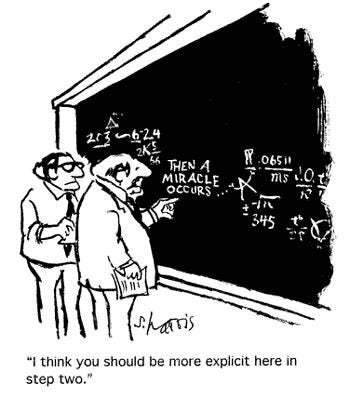

<div id="sumario" class="sumario-git">
    <h1>Sumário</h1>
    <details>
        <summary><a href="#introdução-ao-curso">Introdução</a></summary>
    <ul>
        <li><a href="#matemática-e-computação">Matemática e computação</a></li>
    </ul>
    </details>
    <details>
        <summary><a href="#lógica">Lógica</a></summary>
        <ul>
            <li><a href="#clareza-e-precisão-no-código">Clareza e precisão no código</a></li>
            <li><a href="#depuração-eficaz">Depuração eficaz</a></li>
            <li><a href="#design-de-algoritmos">Design de algoritmos</a></li>
            <li><a href="#verificação-e-testes">Verificação e testes</a></li>
        </ul>
    </details>
    <details>
         <summary><a href="#elementos-da-lógica-formal">Elementos da lógica formal</a></summary>
        <ul>
            <li><a href="#proposições">Proprosições</a></li>
            <li><a href="#conectivos-lógicos">Conectivos lógicos</a>
                <ul> 
                    <li><a href="#negação">Negação</a></li>
                    <li><a href='#conjunção'>Conjunção</a></li>
                    <li><a href='#disjunção'>Disjunção</a></li>
                    <li><a href='#implicação'>Implicação</a></li>
                    <li><a href='#bi-implicação'>Bi-implicação</a></li>
                    <li><a href='#contradição'>Contradição</a></li>
                </ul>
            </li>
        </ul>
    </details>
  <button class="toggle-button" id="toggle-button">
  
      Esconder Sumário
  
  </button>
</div>

<!--<div style="text-align: center;"> 
</div>
-->

<br>

# Dia 1 | Benefícios da Lógica na Programação

## Introdução ao curso
Olá a todos! Sejam bem-vindos ao primeiro dia do nosso minicurso de Introdução às Demonstrações Matemáticas. Neste curso iremos buscar entender qual a ligação entre a Matemática e a Computação, como as Demonstrações Matemáticas são parte essencial da nossa área e quais benefícios podemos tirar delas! 

### Matemática e Computação
A computação tem suas raízes profundamente entrelaçadas com a matemática, visto que toda a sua base teórica veio do trabalho de diversos matemáticos ao longo dos últimos séculos, desde a criação do primeiro algoritmo feito por Ada Lovelace, até as definições formais de computadores, e o significado  “ser computável” feitas por Alan Turing e Alonzo Church. Além disso, figuras como George Boole, criador da álgebra booleana, e John Von Neumann, com sua arquitetura de computadores, mostraram como conceitos puramente matemáticos podem influenciar a nossa área.

## Lógica
Para começarmos a entender mais profundamente a influência da matemática na programação, e como conceitos matemáticos se relacionam com a área da Computação, precisamos ser introduzidos à Lógica, que estrutura toda a matemática que conhecemos, e quais seus benefícios na nossa área.

### Clareza e Precisão no Código
A lógica nos permite estruturar soluções de forma clara e concisa. Ao aplicar princípios lógicos, podemos garantir que cada linha de código tenha um propósito bem definido e que o fluxo do programa seja facilmente compreendido.
- Estruturas de Controle: As estruturas de controle, como `if/else`, `while` e `for`, são a espinha dorsal de qualquer programa. Elas dependem intrinsecamente de condições lógicas bem definidas para guiar o fluxo de execução. Uma condição lógica mal formulada pode levar a um comportamento inesperado ou a erros difíceis de rastrear.
- Pensamento Algorítmico: A lógica nos treina a pensar de forma algorítmica, ou seja, a decompor um problema complexo em passos menores e mais gerenciáveis. Cada passo é uma decisão lógica que contribui para a solução geral.

#### Exemplo
Imagine que queremos criar um programa que verifica se um aluno foi aprovado ou reprovado em uma disciplina. Para ser aprovado, o aluno precisa ter nota maior ou igual a 60 **E** frequência maior ou igual a 75%. Se apenas uma dessas condições não for atendida, ele será reprovado.

```python
# Lógica bem definida
nota = 65
frequencia = 80

if nota >= 60 and frequencia >= 75:
    print("Aluno Aprovado!")
else:
    print("Aluno Reprovado!")

# Saída: Aluno Reprovado!
```

Agora, vamos ver um exemplo de como uma lógica mal definida pode levar a erros.

```python
# Lógica mal definida
nota = 70
frequencia = 70

if nota >= 70 or frequencia >= 75:
    print("Aluno Aprovado!")
else:
    print("Aluno Reprovado!")

# Saída: Aluno Aprovado! (Incorreto, pois a frequência é menor que 75)
```
Nesse segundo exemplo, a utilização do operador 'ou' (OR) em vez do 'e' (AND) resultou em uma aprovação indevida. Isso demonstra como a precisão na lógica é crucial para o comportamento correto do programa.

Portanto, uma simples mudança no código pode fazer com que os resultados mudem drasticamente. Por mais que seja um exemplo bobinho, é importante que o programador, ao escrever seu código, saiba exatamente como ele deve se comportar.

### Depuração Eficaz
Mesmo que você sempre aplique boas técnicas de programação, é comum que algum ponto "passe batido", ou você pode ficar responsável por revisar algum código que não tenha sido bem escrito. É aí que entra o processo de depuração: Seguir o fluxo do código para identificar em qual ponto o erro ocorreu, e corrigi-lo. Vejamos um exemplo:

#### Exemplo
Suponha que temos um programa que calcula o dobro do módulo de um número.

```python
def calcular_dobro_modulo(numero):
    if numero > 0:
        numero = numero *2
        return numero
    else:
        numero = numero *-1
        numero = numero +2
        return numero
    
print(calcular_dobro_modulo(5))   # Output: 10
print(calcular_dobro_modulo(-5))  # Output: 7
```

10 é o dobro do módulo de 5, então nosso código funciona para essa entrada. Porém, 7 não é o dobro do módulo de -5. Vamos investigar:

- Primeiro, verificamos a entrada: `numero = -5`;
- Entramos no `if`;
  - A condição `numero > 0` é `False`;
- Saímos do `if` e entramos no `else`;
  - Então a operação `numero = numero * -1` é executada;
  - Temos `numero = 5 * -1 = 5`;
  - A operação `numero = numero+2 = 7` é executada

**Achamos nosso erro!** No lugar de multiplicar por 2, foi somado 2. Existem muitos motivos que podem ter levado a esse erro, como também existem muitas maneiras de corrigi-lo. A mais simples é trocando o símbolo de soma pelo da multiplicação.

```python
def calcular_dobro_modulo(numero):
    if numero > 0:
        numero = numero *2
        return numero
    else:
        numero = numero *-1
        numero = numero *2
        return numero
    
print(calcular_dobro_modulo(5))   # Output: 10
print(calcular_dobro_modulo(-5))  # Output: 10
```

Mais uma vez, um exemplo simples, mas que mostra que esse tipo de abordagem pode ser útil. Por mais que pareça bobinho, esse tipo de erro de digitação é relativamente comum.

### Design de Algoritmos
Parte da lógica é fazer as coisas na ordem correta. Portanto, antes de escrever qualquer linha de código, precisamos entender o que o programa deve fazer. A lógica nos permite expressar requisitos e especificações de forma precisa e sem ambiguidades. É a ferramenta fundamental para pensar na sequência de passos que o algoritmo deve seguir, nas decisões que ele precisa tomar e nas repetições necessárias para alcançar o objetivo. No lugar de **programar e pensar** ao mesmo tempo, podemos montar uma solução e só depois partir para o código.

#### Exemplo
Imagine que precisamos criar um algoritmo para encontrar o maior número em uma lista. Como podemos fazer isso?

1. Precisamos de um lugar para armazenar o maior número que encontramos até agora. Vamos chamá-lo de `maior_numero_encontrado`;
2. Vamos começar assumindo que o primeiro número da lista é o maior;
3. Precisamos olhar cada número na lista, um por um;
4. Para cada número, vamos compará-lo com o `maior_numero_encontrado`;
5. Se o número atual for maior que o `maior_numero_encontrado`, então o número atual se torna o novo `maior_numero_encontrado`;
6. Depois de verificar todos os números, o `maior_numero_encontrado` será o maior número da lista.

```python
def encontrar_maior_numero(lista):
    # Assume o primeiro como o maior
    maior_numero_encontrado = lista[0]

    # Itera sobre os elementos da lista
    for numero in lista:
        if numero > maior_numero_encontrado:
            maior_numero_encontrado = numero

    return maior_numero_encontrado

lista = [10, 5, 20, 8, 15]
print(encontrar_maior_numero(lista))
# Saída: 20
```

### Verificação e Testes
Depois de escrever um programa, precisamos ter certeza de que ele funciona como esperado, ou seja, precisamos testá-lo. Esta etapa pode não fazer muito sentido em *softwares* mais simples (trabalhos da faculdade, por exemplo), mas Aplicações Críticas ou Aplicações Comerciais/Empresariais têm uma tolerância menor a comportamentos inesperados, então a parte de testes acaba tendo uma importância bem maior. A lógica nos ajuda a formular testes que cubram diferentes caminhos de execução do código, validando todas as condições lógicas e ramificações.

O raciocínio lógico nos permite criar casos de teste abrangentes, incluindo:
- Casos de Borda (Edge Cases): Valores mínimos e máximos, listas vazias, strings nulas, etc.
- Casos de Sucesso: Entradas que devem produzir o resultado esperado.
- Casos de Falha: Entradas que devem acionar mensagens de erro ou comportamento específico.

#### Exemplo
Para a nossa função calcular_dobro, vamos pensar em casos de teste usando a lógica.

- Caso de Sucesso (número positivo): Se a entrada é 5, a saída deve ser 10.
- Caso de Sucesso (número negativo): Se a entrada é -5, a saída deve ser -10.
- Caso de Sucesso (zero): Se a entrada é 0, a saída deve ser 0.


```python
def calcular_dobro(numero):
    return numero * 2

# Casos de Teste
assert calcular_dobro(5) == 10, "Erro: 5 * 2 deveria ser 10"
assert calcular_dobro(-5) == -10, "Erro: -5 * 2 deveria ser -10"
assert calcular_dobro(0) == 0, "Erro: 0 * 2 deveria ser 0"

print("Todos os testes passaram para calcular_dobro!")
```

Abordagens de testes guiadas por raciocínio lógico nos permite não apenas verificar se o código funciona para casos óbvios, mas também garantir sua robustez em cenários complexos e nos limites das condições. Testes são, em essência, pequenas demonstrações de que nosso código se comporta conforme o esperado sob certas condições. Eles não provam a ausência de bugs, mas aumentam significativamente a confiança na qualidade e na corretude do software, reduzindo riscos e facilitando a manutenção a longo prazo.
—

## Elementos da Lógica Formal
Agora que vimos os benefícios práticos da lógica, vamos aprofundar um pouco mais nos conceitos fundamentais. Pois bem! A lógica é o 'estudo do raciocínio válido e das inferências'. É uma ferramenta poderosa para a dedução, baseada em hipóteses e premissas. Pensar logicamente é algo que fazemos o tempo todo, mesmo sem perceber. Quando tomamos decisões no dia a dia, resolvemos problemas ou argumentamos sobre algo, estamos aplicando a lógica.

### Proposições
No contexto da lógica formal, um dos blocos construtivos mais básicos são as **proposições**.

Uma proposição é uma **afirmação declarativa que pode ser classificada como verdadeira ou falsa**, mas nunca ambas simultaneamente. É crucial que a afirmação não seja ambígua.

#### Exemplo
Vamos ver alguns exemplos para fixar esse conceito. Para cada frase, digam se é uma proposição e, se for, qual seu valor verdade.

```
Natal é a capital do Rio Grande do Norte!

Sim, é uma proposição. O valor verdade é Verdadeiro.
```

```
Natal não é a capital do Rio Grande do Norte!

Sim, é uma proposição. O valor verdade é Falso.
```

```
2 + 2 = 5

Sim, é uma proposição. O valor verdade é Falso
```

```
Que horas são?

Não, não é uma proposição. É uma pergunta.
```

```
Feche a porta.

Não, não é uma proposição. É uma ordem.
```

```
x+3=7.

Não é uma proposição, pois o valor verdade depende do valor de x.
```

```
Todo número par é divisível por 2.

Sim, é uma proposição. O valor verdade é Verdadeiro.
```

- Se alguns exemplos não ficaram muito claros, não se preocupem, esse tipo de conhecimento vai ser aprimorado com o tempo
- **OBS:** É comum usar um símbolo para representar uma proposição. Normalmente, as letras **P** e **Q** são utilizadas, mas isso não significa que outros símbolos não possam ser usados.

### Conectivos Lógicos
As proposições podem ser combinadas para formar proposições mais complexas usando conectivos lógicos. Cada conectivo tem uma regra específica para determinar o valor verdade da proposição composta. Vamos explorar os principais e suas tabelas verdade.

#### Negação
A negação de uma proposição simplesmente inverte seu valor verdade. Se **P** é verdadeira, **¬P** é falsa, e vice-versa.

**Tabela Verdade**
| P | ¬P |
|---|---|
| V | F |
| F | V |

- P: 'O sol é uma estrela.' (Verdadeiro)

- ¬P: 'O sol não é uma estrela.' (Falso)

#### Conjunção
A conjunção de duas proposições **P** e **Q** (lê-se **P e Q**) é verdadeira se ambas **P** e **Q** forem verdadeiras. Em todos os outros casos, é falsa.

**Tabela Verdade**

| P | Q | P ∧ Q |
|---|---|-------|
| V | V  | V |
| V | F | F |
| F | V | F |
| F | F | F |

Exemplo prático:

- P: 'Está chovendo.'
- Q: 'Estou com guarda-chuva.'
- P ∧ Q: 'Está chovendo e estou com guarda-chuva.'

Esta proposição será verdadeira apenas se ambas as condições (chuva e guarda-chuva) forem verdadeiras.

#### Disjunção
A disjunção de duas proposições **P** e **Q** (lê-se **P ou Q**) é verdadeira se pelo menos uma das proposições **P** ou **Q** for verdadeira. É falsa apenas se ambas **P** e **Q** forem falsas.

---
##### Diferenças com o Português
É importante lembrar que existe uma certa diferença entre o **"ou" lógico** e o **"ou" cotidiano**. Em português, se dissermos "*este ano viajarei para João Pessoa ou Recife*", normalmente queremos dizer que:
1. Se eu viajar para João Pessoa, então não viajarei para Recife; por outro lado
2. Se eu viajar para Recife, então não viajarei para João Pessoa 

Perceba que, neste caso, fazer uma coisa significa que não farei a outra. Porém, usando conectivos lógicos, as afirmações **1.** e **2.** não seriam, necessariamente, verdadeiras.

---

**Tabela Verdade**

| P | Q | P ∨ Q |
|---|---|-------|
| V | V | V |
| V | F | V |
| F | V | V |
| F | F | F |

Exemplo Prático:

- P: 'Vou viajar para João Pessoa.'

- Q: 'Vou viajar para Recife.'

- P ∨ Q: 'Vou viajar para João Pessoa ou vou viajar para Recife.'

Esta proposição é verdadeira se eu viajar para João Pessoa, viajar para Recife, ou se eu fizer as duas coisas. Só será falsa se eu não viajar para João Pessoa e não viajar para Recife.


#### Implicação
A implicação de **P** para **Q** (lê-se '**Se P então Q**') é falsa apenas quando **P** é verdadeira e **Q** é falsa. Em todos os outros casos, é verdadeira."

**Tabela Verdade**

| P | Q | P ⟹ Q |
|---|---|--------|
| V | V | V |
| V | F | F |
| F | V | V |
| F | F | V |

Exemplo Prático:

- P: 'Chove.'

- Q: 'A rua fica molhada.'

- "P ⟹ Q: 'Se chover, então a rua fica molhada.'

Esta proposição só será falsa se chover (**P** verdadeira) e a rua não ficar molhada (**Q** falsa), o que é um cenário inconsistente com o senso comum. Se não chover (**P** falsa), a proposição é considerada verdadeira, independentemente se a rua está molhada ou não (pode ter sido lavada, por exemplo).

##### Valor Verdade por Vacuidade:

Existe um conceito interessante na lógica chamado verdade por vacuidade. Uma proposição condicional **Se P então Q** é considerada verdadeira se a premissa **P** for falsa, independentemente do valor verdade de **Q**. Por exemplo, '*Se 2 + 2 = 5, então o céu é verde*'. Como a premissa '*2 + 2 = 5*' é falsa, a proposição inteira é verdadeira, mesmo que '*o céu é verde*' seja falsa. Isso pode parecer contraintuitivo, mas é uma **convenção** importante na lógica formal.

#### Bi-implicação
A bi-implicação de **P** e **Q** (lê-se '**P se e somente se Q**') é verdadeira se P e Q tiverem o mesmo valor verdade (ambas verdadeiras ou ambas falsas). É falsa se tiverem valores verdade diferentes."

**Tabela Verdade**

| P | Q | P ⟺ Q |
|---|---|--------|
| V | V | V |
| V | F | F |
| F | V | F |
| F | F | V |

Exemplo Prático:

- P: 'Você passa na disciplina.'

- Q: 'Você tira nota maior ou igual a 7.'

- P ⟺ Q: 'Você passa na disciplina se e somente se tirar nota maior ou igual a 6.'

- Isso significa que passar na disciplina está diretamente ligado a tirar nota 6 ou mais. Se você passar, significa que tirou nota 6 ou mais, e vice-versa. Se uma é verdadeira e a outra falsa, a bi-implicação é falsa."

#### Contradição
Uma contradição é uma proposição que é sempre falsa, independentemente do valor verdade de suas proposições componentes. Por exemplo, '*Está chovendo **e** não está chovendo*'.

**Tabela Verdade**

| P | ¬P | P ∨ ¬P |
|---|----|--------|
| V | F  | F |
| F | V  | F |


#### Tautologia:
Uma tautologia é uma proposição que é sempre verdadeira, independentemente do valor verdade de suas proposições componentes. Por exemplo, '*Está chovendo **ou** não está chovendo*'.

**Tabela Verdade**

| P | ¬P | P ∨ ¬P |
|---|----|--------|
| V | F  | V |
| F | V  | V |
