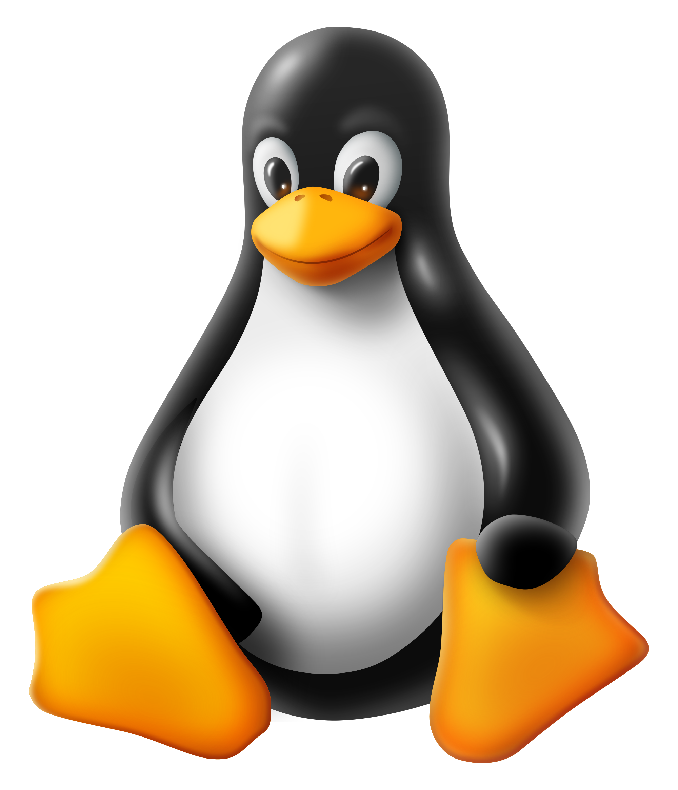

# Primeiros passos no Linux

    <h1>Sumário</h1>
    

        
<a href="#para-que-serve-a-matemática-na-computação">Para que serve a matemática na computação</a>

    <ul>
        <li><a href="#a-matemática-como-berço-da-computação ">A matemática como berço da computação</a></li>
        <li><a href="#a-ponte-para-o-presente">A ponte para o presente</a></li>
    </ul>
    

    

            
<a href="#as-demonstrações-matemáticas">As demonstrações matemáticas</a>

        <ul>
            <li><a href="#como-demonstramos-alguma-coisa">Como demonstramos alguma coisa</a></li>
            <li><a href="#terminologia-básica">Terminologia básica</a></li>
        </ul>
    

    

         
<a href="#exemplos-práticos">Exemplos práticos</a>

        <ul>
            <li><a href="#demonstrando-a-comutatividade-da-união">Demonstrando a comutatividade da união</a></li>
        </ul>
    

  <button class="toggle-button" id="toggle-button">
  
      Esconder Sumário
  
  </button>

 

 

## Para que serve a matemática na computação?  

<cite>&mdash; "Por que preciso estudar matemática para aprender a programar?"</cite>  
<cite>&mdash; "Pra que eu vou usar matemática no mercado de trabalho?"</cite>  
<cite>&mdash; "Precisa ser bom em matemática pra ser um bom programador?"</cite>  

Essas são perguntas que você já deve ter ouvido (ou se perguntado) ao refletir sobre o papel da matemática na ciência da computação e suas áreas. A resposta é simples: **a matemática é o alicerce da tecnologia**. Ela vai além da ideia de "contas e fórmulas" do ensino médio/fundamental — seu verdadeiro papel é nos ensinar a **pensar de forma lógica, abstrata e criativa**, habilidades essenciais para resolver problemas complexos. Não é necessário ser um gênio da matemática para ser um bom programador, mas entender os conceitos e aplicações torna seu trabalho muito mais fácil e eficiente.

| >>> Seção abaixada gerada por IA, sujeita a mundanças

### A matemática como berço da computação 
A computação moderna nasceu de uma necessidade histórica de automatizar o pensamento humano. No século XIX, durante a Revolução Industrial, **Charles Babbage** projetou a **Máquina Analítica** — a primeira ideia de um computador programável. Mas foi **Ada Lovelace**, matemática e filha do poeta Lord Byron, quem deu vida ao conceito. Em 1843, ao traduzir um artigo sobre a máquina de Babbage, Lovelace acrescentou notas que mudariam a história: ela percebeu que a máquina poderia processar **símbolos além de números** (como música ou texto) se programada com algoritmos matemáticos. Seu algoritmo para calcular números de Bernoulli é considerado o **primeiro programa de computador da história**. Lovelace fez isso porque enxergava a matemática como uma **"linguagem universal"** para expressar qualquer forma de conhecimento.  

Quase 100 anos depois, em meio à Segunda Guerra Mundial, o matemático **Alan Turing** enfrentou um problema prático e urgente: decifrar os códigos da máquina **Enigma**, usada pelos nazistas para comunicações secretas. Mas seu trabalho na equipe de Bletchley Park (Reino Unido) só foi possível graças a uma revolução teórica que ele liderara anos antes. Em 1936, Turing respondeu a um desafio matemático do século XX — o **"Entscheidungsproblem"** (problema da decisão), proposto por David Hilbert — criando um modelo abstrato chamado **Máquina de Turing**. Esse dispositivo teórico, baseado em regras lógicas simples (como ler/escrever símbolos e mudar estados), provou que **qualquer problema computável** poderia ser resolvido por algoritmos. A guerra apenas acelerou a aplicação prática: Turing usou estatística e teoria da probabilidade para projetar a **"Bombe"**, máquina que automatizou a quebra da Enigma, salvando milhões de vidas.  

### A ponte para o presente  
Essa evolução mostra como crises históricas (industrialização, guerras) e mentes matemáticas se entrelaçaram:  
- Lovelace transformou **ferramentas de cálculo** em **máquinas de pensamento**;  
- Turing transformou **teoria abstrata** em **salvação prática** durante a guerra;  
- Ambos provaram que computação é **matemática em ação**.  

Hoje, quando você usa um GPS (que aplica teoria dos grafos), streaming (recomendação por álgebra linear) ou criptomoedas (criptografia de teoria dos números), está colhendo os frutos dessa jornada. Por isso, começaremos nosso curso com **lógica e demonstrações matemáticas** — não para fazer "contas", mas para você dominar a arte de **transformar abstrações em revoluções tecnológicas**.  

| >>> Fim da seção

## As demonstrações matemáticas
Uma parte fundamental do trabalho de um matemático é **provar a verdade** do que seu trabalho propõe, é para isso que servem as **demonstrações**, também chamadas de prova formal, ou simplesmente prova. Na computação, as demonstrações são muito utilizadas para provar a **corretude de algoritmos**, como veremos futuramente neste curso.

### Como demonstramos alguma coisa?
Diferente de outras ciências, na matemática não provamos coisas a partir de evidências empíricas. O que fazemos é seguir um processo lógico rigoroso, onde partindo de uma verdade (já existente) e chegamos a uma nova verdade (o que se desejava provar) a partir de transformações (como regras de inferência) que preservam a verdade. **Acho q precisa melhorar esse texto dps, mas por enquanto ta bom**

### Terminologia básica

**Proposição**: Uma afirmação que pode ser demonstrada como verdadeira ou falsa. É o bloco básico do raciocínio matemático.

**Teorema**: Uma proposição de grande importância que foi demonstrada como verdadeira.

**Lema**: Um "teorema auxiliar" - uma proposição provada que serve principalmente como passo intermediário para provar um teorema maior.

**Corolário**: Uma consequência direta de um teorema já demonstrado, que muitas vezes requer pouca ou nenhuma prova adicional.

**Conjectura**: Uma proposição que se acredita ser verdadeira, mas que ainda não foi provada (nem refutada).

**Axioma**: Uma proposição considerada evidentemente verdadeira e que serve como ponto de partida para construir teorias. Não precisa ser demonstrado.

## Exemplos práticos
Vamos ver alguns exemplos práticos de demonstrações e outros conceitos.

### Demonstrando a comutatividade da união
**Proposição**:
Para quaisquer conjuntos `(A)` e `(B)`, vale que `A U B = B U A`

**Prova Direta:**
Tome `x`, tal que `x ∈ A U B`.

Pela definição da união, temos que `x ∈ A e x ∈ B`. 

Pela comutatividade do operador lógio `e`, temos que `x ∈ B e x ∈ A`.

Novamente aplicando a definição da união, temos `x ∈ B U A`

Dessa forma, partindo da premissa `x ∈ A U B`, chegamos a `x ∈ B U A`.
| Opiniões do formato da demonstração e sugestões de outras demonstrações (mais fáceis, q não usem definições q os alunos n tem conhecimento sla) porfavor. A partir do que a gente decidir, montamos as proximas demonstrações. Tava pensando em usar uns códigos simples em python p ajudar a visualizar essas demonstrações.|