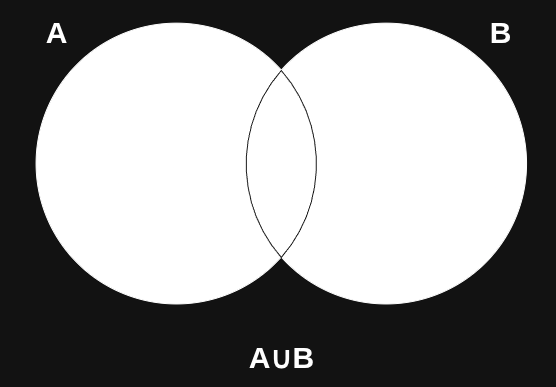
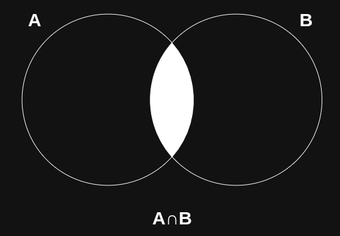
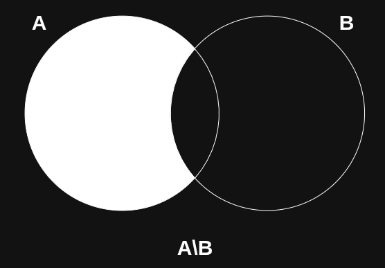
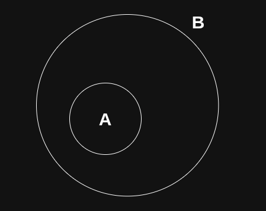

    <h1>Sumário</h1>
    
<a href="#git-avancado">Git avançado</a>

    <ul>
      <li>
        

          
<a href="#desfazendo-alteracoes">Desfazendo alterações</a>

          <ul>
            <li><a href="#desfazendo-commits-sem-ter-publicado">Desfazendo commits sem ter publicado</a></li>
          </ul>
        

      </li>
      <li>
        

          
<a href="#workflow-avancado">Workflow avançado</a>

          <ul>
            <li><a href="#git-branching">Git branching</a></li>
          </ul>
        

      </li>
      <li>
        

          
<a href="#git-merging">Git merging</a>

          <ul>
            <li><a href="#fast-forward-merge">Fast-forward merge</a></li>
            <li><a href="#three-way-merge">Three-way merge</a></li>
            <li><a href="#lidando-com-conflitos">Lidando com conflitos</a></li>
          </ul>
        

      </li>
      <li><a href="#projeto-pt1">Projeto pt.1</a></li>
    </ul>
  <button class="toggle-button" id="toggle-button">
  
      Esconder Sumário
  
  </button>
  

# Interseção entre Conjuntos e Programação

Lorem ipsum dolor sit amet, consectetur adipiscing elit, sed do eiusmod tempor incididunt ut labore et dolore magna aliqua. Ut enim ad minim veniam, quis nostrud exercitation ullamco laboris nisi ut aliquip ex ea commodo consequat. Duis aute irure dolor in reprehenderit in voluptate velit esse cillum dolore eu fugiat nulla pariatur. Excepteur sint occaecat cupidatat non proident, sunt in culpa qui officia deserunt mollit anim id est laborum.

Lorem ipsum dolor sit amet, consectetur adipiscing elit, sed do eiusmod tempor incididunt ut labore et dolore magna aliqua. Ut enim ad minim veniam, quis nostrud exercitation ullamco laboris nisi ut aliquip ex ea commodo consequat. Duis aute irure dolor in reprehenderit in voluptate velit esse cillum dolore eu fugiat nulla pariatur. Excepteur sint occaecat cupidatat non proident, sunt in culpa qui officia deserunt mollit anim id est laborum.

Lorem ipsum dolor sit amet, consectetur adipiscing elit, sed do eiusmod tempor incididunt ut labore et dolore magna aliqua. Ut enim ad minim veniam, quis nostrud exercitation ullamco laboris nisi ut aliquip ex ea commodo consequat. Duis aute irure dolor in reprehenderit in voluptate velit esse cillum dolore eu fugiat nulla pariatur. Excepteur sint occaecat cupidatat non proident, sunt in culpa qui officia deserunt mollit anim id est laborum.

## Teoria dos Conjuntos

Agora que fomos apresentados às utilidades dos conjuntos na programação, podemos utilizar a Teoria dos Conjuntos para aprofundar nosso conhecimento sobre as definições matemáticas nas quais são embasadas todas as estruturas de dados vistas anteriormente! 

### Conjuntos

Na matemática, um conjunto (denotado por {}), é uma coleção de elementos de um mesmo tipo independente de ordem e da repetição de seus elementos. Vamos entender um pouco essa definição:

- Independente de ordem: Os conjuntos {1, 2, 3, 4} e {4, 3, 1, 2} são iguais por definição.

- Independente de repetição: Os conjuntos {42, 42 ,84} e {42, 84} são iguais por definição.

#### "Interface" dos conjuntos

Pela definição de um conjunto, as únicas “perguntas” que podemos fazer a ele são se um elemento de um mesmo tipo pertence ou não a ele. Como assim?

Dado o conjunto de inteiros A = {3, 5, 7, 90, 21, 42}, a única forma válida de acessar os elementos desse conjunto são pelas proposições que seguem o seguinte formato:

- 5 ∈ A&nbsp;&nbsp;&nbsp;&nbsp;&nbsp;&nbsp;&nbsp;[possui valor True]
- 42 ∉ A&nbsp;&nbsp;&nbsp;&nbsp;&nbsp;[possui valor False]
- 12 ∈ A&nbsp;&nbsp;&nbsp;&nbsp;&nbsp;[possui valor False]

Ou seja, só podemos perguntar se um elemento **do mesmo tipo dos elementos do conjunto A** pertence ou não ao conjunto.

Dessa forma, os seguintes exemplos **não** são "perguntas" válidas ao nosso conjunto A:

- Fiat uno ∈ A
- umberto ∉ A
- 43,9 ∈ A
- 4 está no indice 3 do conjunto A
- 3 aparece 2 vezes no conjunto A

#### Definindo um conjunto

Podemos definir um conjunto de várias maneiras, dentre elas:

- Citar diretamente todos os elementos do conjunto, usando chaves ({ }) : A = {1, 2, 3, 7, 5, 42}

- Definir o que significa pertencer ao conjunto: x ∈ A ≝ x tem propriedade y

- Set comprehension: A ≝ {x \| x tem propriedade y}

Vamos definir o conjunto de todas as pessoas com cabelo longo, usando dois dos métodos que acabamos de conhecer:

> L = { p \| p tem cabelo longo}

> p ∈ L ≝ p tem cabelo longo

---

##### Exercícios

Agora que aprendemos a definir conjuntos, defina os conjuntos a seguir, utilizando a notação que você mais gostou:

- Conjunto de todos os primos pares
- Conjunto de todos os ímpares, menos o 2
- Conjunto com apenas o 2
- Conjunto de conjuntos de racionais

### Operações de conjuntos

Assim como temos definidas operações entre números inteiros como a soma e a multiplicação, podemos definir operações entre dois ou mais conjuntos de um mesmo tipo, vamos explorar algumas delas!

#### União

Dados dois conjuntos A e B de um mesmo tipo, podemos definir a união (∪) binária como:

<strong>x ∈ A∪B ≝ x ∈ A ou x ∈ B&nbsp;&nbsp;&nbsp;&nbsp;&nbsp;&nbsp;ou&nbsp;&nbsp;&nbsp;&nbsp;&nbsp;&nbsp;A∪B ≝ {x | x ∈ A ou x ∈ B}</strong>

Para ajudar na compreensão, podemos visualizar a união dos conjuntos A e B no diagrama:

 

#### Interseção 

Dados dois conjuntos A e B de um mesmo tipo, defina a interseção binária (∩):

<strong>x ∈ A∩B ≝ …&nbsp;&nbsp;&nbsp;&nbsp;&nbsp;&nbsp;ou&nbsp;&nbsp;&nbsp;&nbsp;&nbsp;&nbsp;A∩B ≝ …</strong>

Para ajudar na compreensão, podemos visualizar a interseção dos conjuntos A e B no diagrama:

 

#### Diferença

Dados dois conjuntos A e B de um mesmo tipo, podemos definir a diferença (\) de dois conjuntos como sendo:

<strong>x ∈ A\B ≝ x ∈ A e x ∉ B&nbsp;&nbsp;&nbsp;&nbsp;&nbsp;&nbsp;ou&nbsp;&nbsp;&nbsp;&nbsp;&nbsp;&nbsp;A\B ≝ {x | x ∈ A e x ∉ B}</strong>

Para ajudar na compreensão, podemos visualizar a diferença dos conjuntos A e B no diagrama:

 

#### Complemento

Dado um conjunto A, podemos definir seu complemento como:

<strong>Aᶜ ≝ x ∉ A&nbsp;&nbsp;&nbsp;&nbsp;&nbsp;&nbsp;ou&nbsp;&nbsp;&nbsp;&nbsp;&nbsp;&nbsp;Aᶜ ≝ {x | x ∉ A}</strong>

Para ajudar na compreensão, podemos visualizar o complemento do conjunto A no diagrama:

 

### Relações entre conjuntos

Agora que sabemos como definir conjuntos e suas operações, podemos definir duas relações importantíssimas sobre conjuntos, o contém/contido e a igualdade entre conjuntos.

#### Contém e contido

Dados conjuntos A e B do mesmo tipo, podemos enunciar a proposição "A é subconjunto de B" ou "A está contido em B", mas primeiro precisamos definir o que significa ser subconjunto ou estar contido. Sendo A e B conjuntos temos:

<strong>A⊆B ≝ (∀x)[x ∈ A ⇒ x ∈ B]</strong>

> Podemos ler da seguinte maneira: dizemos que A está contido em B (ou A é subconjunto de B) se todos os elementos de A pertencem a B

 

#### Igualdade

Finalmente podemos entender o que significa dois conjuntos do mesmo tipo serem iguais. A partir do conhecimento que adquirimos até aqui, podemos definir o seguinte: 

Sendo A e B conjuntos, temos:

<strong>A = B ≝ A ⊆ B e B ⊆ A</strong>

> Se abrirmos a definição de (⊆), podemos ler da seguinte forma: A é igual a B, sse todo elemento de A pertencer à B e todo elemento de B pertencer à A.

### Demonstrações sobre conjuntos

Proposições sobre conjuntos são demonstradas ou refutadas utilizando das próprias definições, operações, e relações que vimos anteriormente. Vamos dar uma olhadinha em como se parece uma demonstração envolvendo conjuntos: 

**Sejam A, B e C conjuntos tais que  A ⊆ B e B ⊆ C, demonstre que A ⊆ C.**

Demonstração:

> Relembrando a definição de A ⊆ C, precisamos demonstrar que todo elemento de A pertence a C.

> Temos que todo elemento de A pertence a B, visto que A ⊆ B.

> Temos que todo elemento de B pertence a C, visto que B ⊆ C.

> Como todos os elementos de A pertencem a B, e todos os elementos de B pertencem a C, então todos os elementos de A pertencem a C.

---

##### Exercícios

Seguindo a mesma idéia da demonstração que acabamos de ver, demonstre as seguintes proposições:

> Considere A, B e C conjuntos do mesmo tipo.

- Se A = B e B ⊆ C , então A ⊆ C.
- A ⊆ A ∪ B
- A ⊈ B\A
- Se A ⊆ B & x ∈ A, então x ∈ B

> Nota: sinta-se livre para pedir ajuda caso não consiga prosseguir com alguma demonstração!